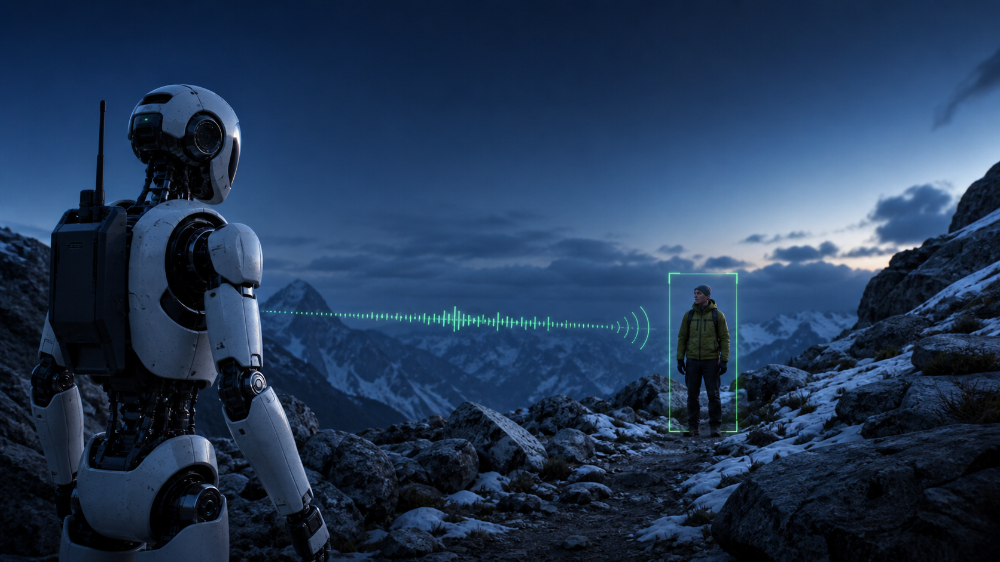
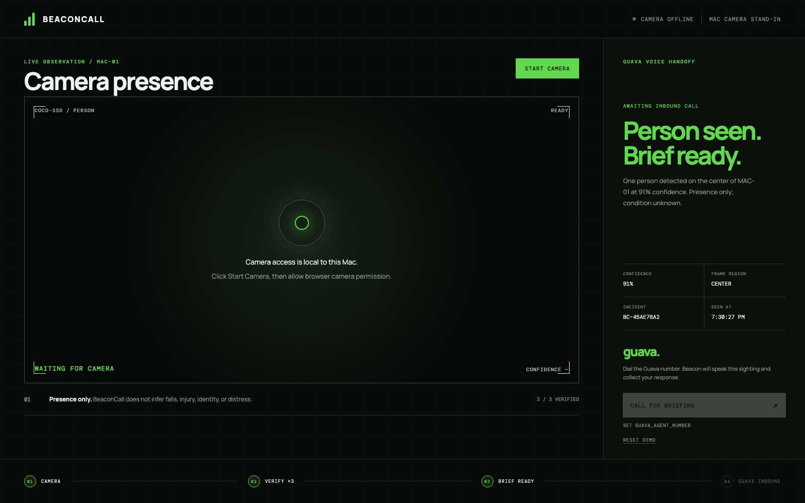
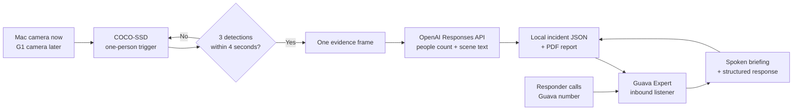

<div align="center">



# BeaconCall

### A robot camera sees people. OpenAI describes the scene. Guava makes sure a human hears it.

**BeaconCall turns a robot-camera sighting into an OpenAI scene report and a live Guava voice briefing.**

[](#quickstart)
[](#guava-is-the-voice-layer)
[](#architecture)
[](#verification)
[](#privacy-and-safety)

[60-second demo](#the-60-second-demo) · [Quickstart](#quickstart) · [Architecture](#architecture) · [Guava integration](docs/GUAVA_INTEGRATION.md) · [Hackathon deck](artifacts/BeaconCall-Guava-Demo.pdf)

</div>

---

## About

Camera alerts are easy to miss, especially when a robot is scouting away from its operator. BeaconCall confirms at least one person across three camera frames, sends one captured frame to OpenAI to count everyone and describe the visible scene, then gives that description to a Guava inbound voice agent. The responder calls the Guava number, acknowledges the report, and receives a graceful rescue-team handoff.

The current project uses a Mac webcam as a stand-in for the robot camera. Later, the same observation endpoint can accept frames from a Unitree G1 without changing the Guava voice workflow.

> [!IMPORTANT]
> BeaconCall describes **observable details only**. It does not identify people or claim that someone fell, is injured, is distressed, or needs emergency assistance. The generated PDF is local and does not contact real rescue services.

## What happens

| 01 — Trigger | 02 — Describe | 03 — Speak | 04 — Report |
|---|---|---|---|
| COCO-SSD sees at least one person across three frames. | OpenAI independently counts all visible people and describes the scene. | Guava briefs the inbound caller with the scene description. | Acknowledgement closes the call and updates a small PDF incident report. |

<p align="center">
  
</p>

## Why this matters

- **A camera alert is silent.** BeaconCall turns it into a conversation.
- **A single frame is noisy.** Temporal confirmation reduces one-frame false alarms.
- **AI should not invent emergencies.** Every briefing explicitly says that presence does not confirm distress.
- **Robots need human decisions.** Guava collects a bounded response and writes it back to the incident.
- **The prototype is demoable today.** No fall acting, fake injury, robot hardware, or public webhook is required.

## Guava is the voice layer

Guava is not a logo-only sponsor integration in BeaconCall. Its hosted Dialog System handles the live audio, speech recognition, conversational turn-taking, and synthesized voice, while the local Python **Expert** supplies the latest verified camera observation.

The Expert uses Guava's real inbound primitives:

- `listen_phone` attaches BeaconCall to a Guava number.
- `on_call_start` loads the latest camera sighting.
- `set_task` creates the briefing and response checklist.
- `Field` constrains the operator response to three choices.
- `on_question` answers follow-ups from live incident context.
- `on_task_complete` records the acknowledgement, refreshes the PDF, and ends with: **“Thanks, I'll get it reported to the rescue team.”**

Guava Experts connect outward over a persistent WebSocket, so the inbound agent can run on a Mac behind NAT without exposing a local web server or using ngrok. See Guava's [architecture overview](https://goguava.ai/docs/architecture-overview), [inbound example](https://goguava.ai/docs/inbound-form-filling), and [Agent reference](https://goguava.ai/docs/agent).

### Why the operator calls inbound

BeaconCall intentionally uses Guava's supported inbound path rather than pretending to place an outbound call:

```text
person trigger → OpenAI scene analysis → operator calls Guava → acknowledgement → PDF report
```

The camera event prepares the call context and activates **Call for briefing**. The human initiates the inbound call.

## Architecture



The system boundary is deliberate: one incident JPEG is sent to OpenAI with response storage disabled. The evidence file and PDF remain under the ignored local `runtime/` directory, and Guava receives the resulting text briefing—not the image.

## Quickstart

### Requirements

- macOS with a camera
- Chrome recommended for WebGL inference
- Node.js 22+ and npm
- [uv](https://docs.astral.sh/uv/)
- [Guava CLI](https://goguava.ai/docs/quickstart)
- An OpenAI API key with access to an image-input model

### 1. Install

```bash
cd /Users/kaushiksivakumar/workspace/beacon-call
make setup
cp .env.example .env
```

### 2. Connect Guava

```bash
guava login
guava numbers list
```

Add the API key and purchased Guava number to `.env`:

```dotenv
GUAVA_API_KEY=gva-...
GUAVA_AGENT_NUMBER=+1...
OAI_API_KEY=sk-...
OAI_VISION_MODEL=gpt-5.6-luna
```

### 3. Run

Terminal 1 — camera console:

```bash
make run
```

Open [http://127.0.0.1:8080](http://127.0.0.1:8080), click **Start Camera**, and allow camera permission.

Terminal 2 — Guava inbound Expert:

```bash
make agent-phone
```

No phone number yet? Exercise the same inbound Expert through Guava WebRTC:

```bash
make agent-webrtc
```

## The 60-second demo

1. Show an empty chair or doorway and the **Scanning / no person** state.
2. Have two people walk into frame and stand normally for about two seconds. One local detection is enough to trigger the next stage.
3. Show every COCO box it finds, then the OpenAI count, scene description, and **Brief ready** state.
4. Call the displayed Guava number and ask: **“What did the robot camera see?”**
5. Answer **“acknowledged”** and let Beacon close with the rescue-team handoff.
6. Download the PDF report, then show the updated incident and Guava Conversations.

Full presenter copy: [docs/DEMO.md](docs/DEMO.md)

## Integrate a Unitree G1 later

The voice agent and incident model do not need to change. Replace the browser producer with a G1 camera process that posts the same observation contract:

```http
POST /api/observations
Content-Type: application/json

{
  "person_present": true,
  "confidence": 0.91,
  "camera_name": "G1-HEAD-CAM",
  "local_people_count": 1,
  "bbox": {
    "x": 220,
    "y": 80,
    "width": 180,
    "height": 410,
    "frame_width": 1280,
    "frame_height": 720
  }
}
```

Post three qualifying observations within four seconds, then upload the incident JPEG to the evidence endpoint. BeaconCall performs the same OpenAI analysis and Guava reads the description on the next inbound call.

## Privacy and safety

- COCO-SSD trigger inference runs locally in the browser.
- One incident frame is sent to OpenAI for people counting and scene description with API response storage disabled.
- The local evidence copy and generated report remain under the ignored `runtime/` directory.
- Camera images are not sent to Guava; Guava receives the text briefing.
- No facial recognition or identity matching is performed.
- No medical or distress classification is performed.
- The call repeats that a sighting is not a confirmed emergency.
- `.env` and runtime evidence are excluded from git.

## Verification

```bash
make test
```

Verified on Apple silicon:

- 11 Python tests
- 2 TypeScript tests
- Ruff clean
- TypeScript strict-mode clean
- Production Vite bundle succeeds
- npm production audit reports zero vulnerabilities
- Five-page deck artifacts validated

## Project map

```text
beacon-call/
├── beacon_call/          # API, OpenAI scene analysis, reports, and detection gate
├── web/                  # Camera-first operator console
├── main.py               # Guava inbound Expert
├── tests/                # Python behavior tests
├── docs/                 # Demo and sponsor implementation notes
├── assets/               # README hero and product screenshots
└── artifacts/            # PowerPoint, PDF, and browser deck
```

## Road to 5,000 stars

If this direction is useful, **star the repository** and share the 60-second demo. Stars help prioritize the integrations people actually want:

- [x] Mac camera presence detection
- [x] OpenAI multi-person count and scene description
- [x] Guava inbound voice briefing
- [x] Human response written back to the incident
- [x] Downloadable PDF incident report
- [ ] Unitree G1 head-camera adapter
- [ ] RTSP and recorded-video inputs
- [ ] Multi-camera incident queue
- [ ] On-device Apple Vision/Core ML backend
- [ ] Community rescue-robot scenario pack

The fastest way to help is to open an issue with your camera source, robot platform, or rescue workflow.

## Hackathon materials

- [Five-slide PowerPoint](artifacts/BeaconCall-Guava-Demo.pptx)
- [Five-page PDF](artifacts/BeaconCall-Guava-Demo.pdf)
- [Browser deck](artifacts/BeaconCall-Guava-Demo.html)
- [Demo script](docs/DEMO.md)
- [Exact Guava implementation](docs/GUAVA_INTEGRATION.md)

## Contributing

Small, demoable pull requests are welcome. Good first contributions include a new camera adapter, better detection debouncing, accessibility improvements, and tests for unusual frame sizes. Please keep the project's core safety rule: **presence is not distress**.

---

<div align="center">

### Camera sighting. OpenAI scene report. Guava briefing.

If BeaconCall should become a real G1 integration, give it a ⭐ and tell us what to build next.

</div>

## GitHub About settings

Use these values in **Repository → Settings → General**:

**Description**

> Turn robot-camera sightings into OpenAI scene reports and live Guava voice briefings. Mac-first and G1-ready.

**Topics**

`robotics` · `computer-vision` · `voice-ai` · `guava` · `humanoid-robot` · `unitree-g1` · `emergency-response` · `tensorflowjs` · `fastapi` · `macos` · `hackathon`

**Social preview**

Upload [`assets/beaconcall-social-preview.png`](assets/beaconcall-social-preview.png) for the correctly cropped 2:1 GitHub preview.
