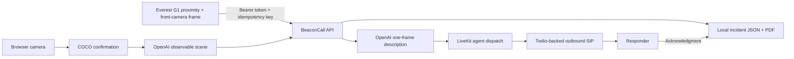

<div align="center">

# BeaconCall

### A robot detects a person. LiveKit makes sure a human hears it.

**BeaconCall turns a bounded robot-camera or simulation observation into one authenticated LiveKit + Twilio outbound call and records the responder's acknowledgment.**

[](docs/LIVEKIT_INTEGRATION.md)
[](docs/LIVEKIT_INTEGRATION.md)
[](#camera-demo)
[](#call-safety)
[](https://render.com/deploy?repo=https://github.com/KaushikSiva/beacon-call)

</div>

## What it does

BeaconCall has two incident producers:

- The browser demo confirms a person across three camera frames and asks OpenAI to describe one evidence frame.
- Everest G1 posts a simulation-grounded proximity event plus one front-camera frame after its controller has stopped beside a downed person. BeaconCall asks OpenAI for an observable description before it dials.

Both produce an observable-facts-only incident. A robot request can explicitly queue one outbound call. BeaconCall dispatches its LiveKit agent first, dials the server-configured recipient through a stored Twilio-backed SIP trunk, speaks the report, waits up to 45 seconds for acknowledgment, records the outcome, and deletes the room to end the call.

> [!IMPORTANT]
> BeaconCall does not identify people, diagnose injury, infer how a person came to be lying down, or contact emergency services. The Everest message explicitly identifies itself as a simulation.

## Architecture



The destination number is read only from the BeaconCall server environment. It is never accepted from an incident request, returned by the API, written to incident JSON, or logged.

## Requirements

- Python 3.11+
- Node.js 22+ for the optional camera console
- [uv](https://docs.astral.sh/uv/)
- A LiveKit Cloud project
- A stored LiveKit outbound SIP trunk connected to Twilio
- An OpenAI API key for vision, transcription, and speech

## Setup

```bash
git clone https://github.com/KaushikSiva/beacon-call.git
cd beacon-call
make setup
cp .env.example .env
```

Fill `.env` locally. Required values are:

```dotenv
BEACON_API_TOKEN=<long-random-token>
BEACON_API_URL=http://127.0.0.1:8080
LIVEKIT_URL=wss://<project>.livekit.cloud
LIVEKIT_API_KEY=<secret>
LIVEKIT_API_SECRET=<secret>
LIVEKIT_SIP_TRUNK_ID=ST_<stored-outbound-trunk>
BEACON_DESTINATION_NUMBER=<server-side-E.164-recipient>
OPENAI_API_KEY=<secret>
```

Do not commit `.env`. See [LiveKit integration](docs/LIVEKIT_INTEGRATION.md) for Twilio trunk setup and call-flow diagnostics.

## Run

Terminal 1 — API and camera console:

```bash
make run
```

Terminal 2 — registered LiveKit agent worker:

```bash
make agent-dev
```

Open <http://127.0.0.1:8080> for the optional camera demo.

## Deploy on Render

The committed [Render Blueprint](render.yaml) deploys one Docker web service
containing both the FastAPI server and the LiveKit production worker. They share
one persistent disk so incident idempotency, reports, and voice acknowledgment
updates survive restarts and remain visible to both processes.

Click **Deploy to Render** above or create a new Blueprint from this repository.
Render will prompt for the LiveKit Cloud, Twilio-backed SIP trunk, destination,
and OpenAI values; it generates `BEACON_API_TOKEN` itself. This requires a paid
service because Render does not support persistent disks on free instances.

After deployment, copy the generated API token from the Render service's
Environment page and use the service's `https://*.onrender.com` URL as
`BEACON_API_URL` in Everest G1. No Render API key is required for the normal
Dashboard/Blueprint flow.

Full instructions: [Render deployment runbook](docs/RENDER_DEPLOY.md).

## One explicitly armed call

After the API and agent are running:

```bash
make call-test
```

The script requires the exact typed confirmation `ARM-LIVE-CALL`. It creates a unique idempotency key and never accepts a destination number on the command line.

## Everest G1 contract

```http
POST /api/incidents/outbound-call
Authorization: Bearer <BEACON_API_TOKEN>
Idempotency-Key: everest-episode-0001
Content-Type: application/json

{
  "simulation_id": "everest-episode-0001",
  "observed_state": "motionless_adult_in_snow",
  "distance_m": 0.12,
  "camera_name": "G1-FRONT-CAMERA",
  "image_data_url": "data:image/jpeg;base64,<one-bounded-frame>"
}
```

The first valid request returns `202` with `duplicate: false`. Repeating the same key returns the existing incident with `duplicate: true` and does not place another call, including after process restart.

The base spoken report is deterministic:

> This is an automated Everest G1 simulation alert, not a real-world emergency. The robot reached a motionless adult lying in snow. Responsiveness and vital signs are unknown. The nearest measured distance is [distance] meters. Please acknowledge receipt.

When the request contains a valid JPEG, BeaconCall analyzes it before LiveKit
dispatch and appends: `OpenAI analysis of the robot's front-camera frame
reports: [observable description]. This is a visual description, not a medical
assessment.` If analysis fails, the base report still places the call without
inventing visual facts.

## Camera demo

The browser runs COCO-SSD locally. After three consecutive detections it uploads one JPEG to the local API, which uses OpenAI for an observable scene description. Evidence and generated PDF reports remain in ignored `runtime/` storage.

The camera path prepares a briefing but does not automatically place a call. Live calling remains restricted to the authenticated incident endpoint or the explicitly armed CLI.

## Call safety

- Bearer authentication is mandatory and fails closed when unconfigured.
- `Idempotency-Key` is mandatory and persisted as a SHA-256 digest.
- The phone number exists only in server-side configuration.
- The agent is dispatched before the SIP participant is created.
- The initial report and closing are deterministic.
- Unknown facts remain unknown; medical and identity inference are prohibited.
- One call waits at most 45 seconds for acknowledgment.
- Completion or timeout deletes the LiveKit room, disconnecting the SIP participant.
- Normal tests mock telephony and cannot place a call.

## Verification

```bash
make test
```

This runs Ruff, Python tests, TypeScript tests, strict type checking, and a production Vite build.

## Project map

```text
beacon_call/
  api.py                 authenticated HTTP surface and camera API
  auth.py                fail-closed bearer validation
  livekit_service.py     dispatch-first outbound SIP orchestration
  models.py              incident and API contracts
  store.py               durable local idempotency and reports
  voice.py               bounded report and acknowledgment rules
main.py                   LiveKit agent worker
scripts/trigger_call.py   explicit one-call commissioning command
web/                      optional camera console
runtime/                  ignored evidence, incident JSON, and PDF reports
```

## Privacy

- No facial recognition or identity matching.
- One camera frame is sent to OpenAI when the browser evidence workflow or an authenticated robot incident supplies it.
- Camera images are not sent to LiveKit or Twilio.
- Secrets and the recipient number are excluded from Git.
- Incident logs contain the simulation ID, distance, call state, and acknowledgment—not credentials or the destination.
